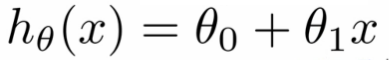

.. _model_and_cost_function:

Model and Cost Function
=======================

Model Representation
--------------------

:math:`x^{(i)}` denotes the input variables also called as **input features**
:math:`y^{(i)}` denotes the output or target variable that we are trying to predict

A pair :math:`{(x^{(i)}, y^{(i)})}` is called a training example, and the dataset that we’ll be using to learn— 
a list of m training examples :math:`{(x^{(i)}, y^{(i)})}`; i=1,...,m— is called a training set.

To describe the supervised learning problem slightly more formally, our goal is, given a training set, 
to learn a function :math:`h : X → Y` so that :math:`h(x)` is a good predictor for the corresponding value of y. 
This function h is called a **hypothesis**. 

.. image:: ../images/hypothesis_process.png
    :align: center

When the target variable that we’re trying to predict is continuous, such as in our housing example, we call the learning problem a regression problem. When y can take on only a small number of discrete values (such as if, given the living area, we wanted to predict if a dwelling is a house or an apartment, say), we call it a classification problem.
