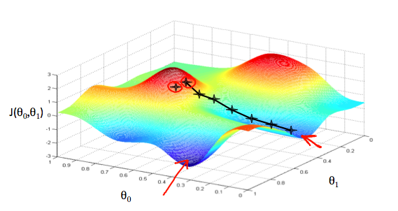

.. _parameter_learning:

Parameter Learning
==================

Gradient Descent
----------------
So we have our hypothesis function and we have a way of measuring how well it fits into the data. Now we need to estimate the parameters in the hypothesis function. 
That's where gradient descent comes in.

Gradient descent is a first-order iterative optimization algorithm for finding the minimum of a function. 
To find a local minimum of a function using gradient descent, one takes steps proportional to the negative of the gradient (or approximate gradient) of the function at the current point. 
If, instead, one takes steps proportional to the positive of the gradient, one approaches a local maximum of that function; the procedure is then known as gradient ascent.

Gradient descent is also known as **steepest descent**.

We will know that we have succeeded when our cost function is at the very bottom of the pits in our graph, i.e. when its value is the minimum. 
The red arrows show the minimum points in the graph.

We make steps down the cost function in the direction with the steepest descent. The size of each step is determined by the parameter :math:`\alpha`, which is called the **learning rate**.

For example, the distance between each 'star' in the graph above represents a step determined by our parameter :math:`\alpha`. 
A smaller :math:`\alpha` would result in a smaller step and a larger :math:`\alpha` results in a larger step. 
The direction in which the step is taken is determined by the partial derivative of :math:`J(\theta_0,\theta_1)`. 
Depending on where one starts on the graph, one could end up at different points. The image above shows us two different starting points that end up in two different places.

The Gradient Descent algorithm is repeat until convergence

:math:`\theta_j := \theta_j - \alpha \frac{\partial}{\partial \theta_j} J(\theta_0, \theta_1)`

where :math:`j=0,1` represents the feature index number.

We can substitute our actual cost function and our actual hypothesis function and modify the equation to:

:math:`\begin{align*} \text{repeat until convergence: } \lbrace & \newline \theta_0 := & \theta_0 - \alpha \frac{1}{m} \sum\limits_{i=1}^{m}(h_\theta(x_{i}) - y_{i}) \newline \theta_1 := & \theta_1 - \alpha \frac{1}{m} \sum\limits_{i=1}^{m}\left((h_\theta(x_{i}) - y_{i}) x_{i}\right) \newline \rbrace& \end{align*}`

where m is the size of the training set, :math:`\theta_0` a constant that will be changing simultaneously with :math:`\theta_1` and :math:`x_{i}, y_{i}` are values of the given training set(data).

This method looks at every example in the entire training set on every step, and is called **batch gradient descent**. Note that, while gradient descent can be susceptible to local minima in general, the optimization problem we have posed here for linear regression has only one global, and no other local, optima; thus gradient descent always converges (assuming the learning rate α is not too large) to the global minimum.